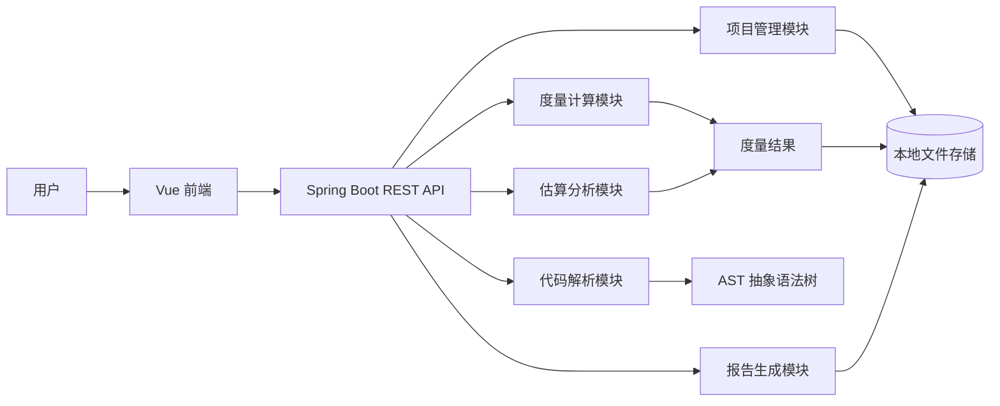
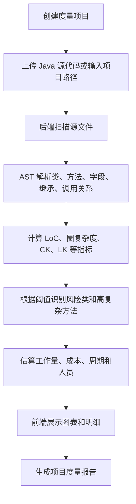
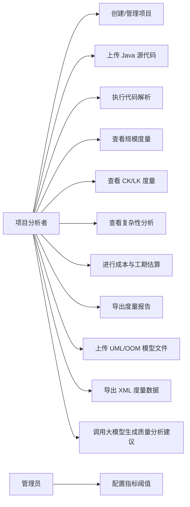
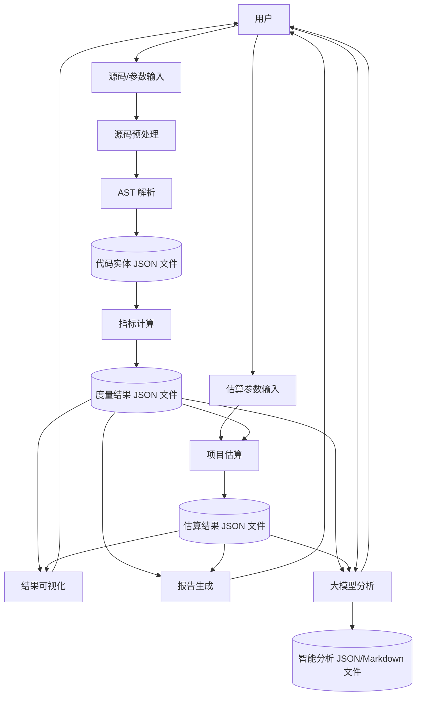
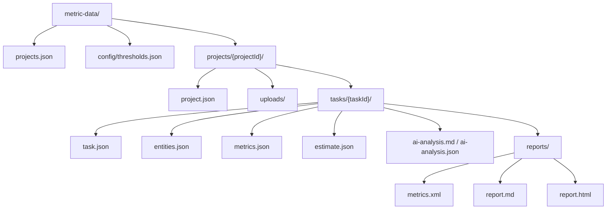
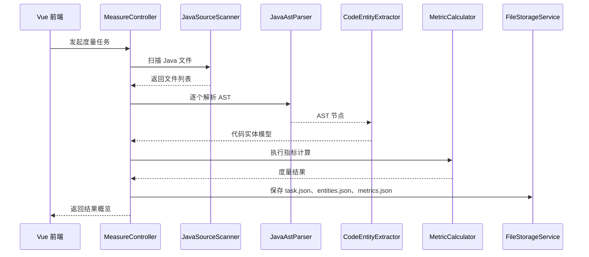
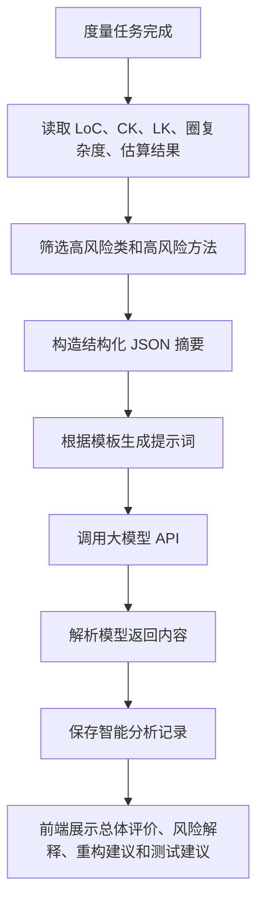

# 软件度量自动化工具实验指导方案

## 1. 实验选题定位

### 1.1 选题名称

中小型软件度量自动化工具的设计与实现

### 1.2 项目方向

本项目选择实验指导书中的项目类型（一）：开发一个中小型软件度量自动化工具。系统以 Java 后端和 Vue 前端为主要技术路线，围绕软件质量保证与软件度量课程中的核心知识，面向软件项目的代码、类、方法、包、设计模型和用户输入数据进行自动化度量、分析、预测和报告生成。

### 1.3 项目目标

项目目标是实现一个可用于 Java 项目质量分析的软件度量平台，能够对上传或指定路径下的 Java 源代码进行解析，提取类、方法、继承、调用、字段、代码行等信息，并在此基础上计算面向对象度量、复杂性度量、规模度量和项目估算指标。

系统应重点体现以下能力：

1. 支持 Java 源代码输入，自动解析项目结构和代码实体。
2. 实现 CK 度量模型中的主要度量点。
3. 实现 LK 度量模型中的部分可落地度量点。
4. 支持代码行数、注释行数、空行数、圈复杂度等传统度量。
5. 支持工作量、成本、开发时间、人员规模等项目实体估算。
6. 支持前端可视化展示度量结果，包括表格、图表、阈值告警和报告导出。
7. 能够结合实际项目样例进行分析，评价工具的准确性、实用性和有效性。

## 2. 实验要求对应关系

| 指导书要求 | 本项目对应实现 |
| --- | --- |
| 开发中小型软件度量自动化工具 | 基于 Spring Boot + Vue 实现 Web 度量平台 |
| 覆盖软件度量课程知识 | 覆盖规模、复杂性、面向对象、成本、人员、时间等指标 |
| 实现 LK 与 CK 模型相关度量点 | CK：WMC、DIT、NOC、CBO、RFC、LCOM；LK：类规模、继承复杂度、耦合、方法复杂度等 |
| 加入圈复杂度、代码行度量 | 对方法级别计算圈复杂度，对文件/类/项目计算 LoC |
| 度量软件规模、工作量、成本、开发时间、人员 | 通过 LoC、KLOC、COCOMO 简化模型和用户输入参数估算 |
| 输入包括设计图、代码、用户输入 | 第一阶段以 Java 代码和用户输入为主，扩展支持类图/用例图信息录入 |
| 建议利用 ASTParser | 后端使用 JavaParser 或 Eclipse JDT ASTParser 解析 Java AST |
| 文档规范完整 | 输出项目设计与实现报告、需求说明、设计图、算法说明、结果分析 |

## 3. 系统总体方案

### 3.1 技术路线

后端建议采用：

- Java 17 或 Java 21
- Spring Boot
- Maven
- JavaParser 或 Eclipse JDT ASTParser
- Jackson，用于 JSON 文件读写
- Java NIO，用于本地文件存储和目录管理

前端建议采用：

- Vue 3
- Vite
- Element Plus 或 Naive UI
- ECharts
- Axios
- Pinia

### 3.2 系统架构



系统采用前后端分离架构。Vue 前端负责项目创建、代码上传、度量任务发起、结果展示和报告导出；Spring Boot 后端负责源码接收、AST 解析、指标计算、本地文件保存和分析报告生成。

本实验项目不连接数据库。考虑到系统主要面向单机实验环境，数据量较小，且多数数据是一次度量任务产生的结构化结果，因此采用本地文件存储。项目配置、任务状态、度量结果和大模型分析结果保存为 JSON 文件，导出结果保存为 XML、Markdown 或 HTML 文件。

### 3.3 核心业务流程



## 4. 功能需求设计

### 4.1 用户角色

系统可以设计为单用户实验系统，也可以扩展为多用户系统。为了降低实现复杂度，建议实验版本采用单用户或简单登录模式。

主要角色：

1. 项目分析者：上传代码、发起度量、查看结果、导出报告。
2. 管理员：管理项目、配置阈值、维护指标参数。

### 4.2 用例图



### 4.3 功能模块

| 模块 | 功能说明 |
| --- | --- |
| 项目管理模块 | 创建项目、修改项目、删除项目、查看历史度量任务 |
| 源码输入模块 | 支持上传 ZIP 包、单个 Java 文件，或输入后端可访问的本地路径 |
| 代码解析模块 | 扫描 Java 文件，构建 AST，提取类、接口、方法、字段、继承和调用信息 |
| 规模度量模块 | 统计总代码行、有效代码行、注释行、空行、文件数、包数、类数、方法数 |
| CK 度量模块 | 计算 WMC、DIT、NOC、CBO、RFC、LCOM 等面向对象指标 |
| LK 度量模块 | 计算类规模、方法复杂度、继承复杂性、耦合度、类间关系等指标 |
| 复杂性度量模块 | 计算方法级圈复杂度，识别高复杂方法 |
| 估算模块 | 根据 KLOC 和参数估算工作量、开发时间、人员和成本 |
| 可视化模块 | 使用 ECharts 展示趋势图、柱状图、雷达图、风险分布 |
| 报告模块 | 生成 Markdown、HTML 或 PDF 格式的度量报告 |
| 阈值配置模块 | 配置复杂度、耦合度、类规模等风险阈值 |
| 功能点度量模块 | 根据外部输入、外部输出、外部查询、内部逻辑文件、外部接口文件计算功能点 |
| 用例图度量模块 | 支持录入或解析用例、参与者、关系数量，用于用例点估算 |
| 面向对象度量模块 | 对类图或代码类结构计算 CBO、DIT、NOC、NOA、NOO、CS 等指标，并用雷达图展示 |
| 控制流图度量模块 | 根据方法 AST 或流程图节点计算圈复杂度，识别复杂分支和高风险路径 |
| 模型文件管理模块 | 支持上传 `.oom`、`.xml`、`.xmi` 等设计模型文件，保存文件信息并触发类分析 |
| XML 导出模块 | 将类、属性、方法、继承关系和度量结果导出为 XML，便于结果复用和报告归档 |
| 大模型分析模块 | 将度量结果、风险阈值和项目背景组织为提示词，调用大模型接口生成质量分析和改进建议 |

### 4.4 数据流图



## 5. 数据需求设计

### 5.1 核心数据实体

系统至少需要保存以下数据：

1. 项目信息：项目名称、语言、描述、创建时间、源码路径。
2. 度量任务：任务编号、项目编号、状态、开始时间、结束时间。
3. 代码文件：文件路径、文件名、包名、代码行、注释行、空行。
4. 类信息：类名、包名、类型、父类、接口、字段数、方法数。
5. 方法信息：方法名、参数数、返回类型、代码行、圈复杂度。
6. 指标结果：指标名称、指标值、指标级别、解释说明。
7. 估算结果：工作量、成本、开发时间、建议人员数量。
8. 阈值配置：指标名称、低风险阈值、中风险阈值、高风险阈值。
9. 设计模型文件：文件名、文件类型、保存路径、解析状态、上传时间。
10. 大模型分析记录：任务编号、模型名称、提示词摘要、分析结论、改进建议、生成时间。

### 5.2 本地文件数据模型图



### 5.3 建议本地文件结构

| 文件或目录 | 说明 |
| --- | --- |
| metric-data/projects.json | 项目索引，用于快速展示项目列表 |
| metric-data/config/thresholds.json | 指标阈值配置，例如复杂度、CBO、LCOM 风险阈值 |
| metric-data/projects/{projectId}/project.json | 单个项目的基本信息 |
| metric-data/projects/{projectId}/uploads/ | 保存上传的 ZIP、Java、OOM、XML、XMI 等原始文件 |
| metric-data/projects/{projectId}/tasks/{taskId}/task.json | 一次度量任务的状态、开始时间、结束时间和错误信息 |
| metric-data/projects/{projectId}/tasks/{taskId}/entities.json | AST 或模型文件解析出的类、方法、字段、继承、调用关系 |
| metric-data/projects/{projectId}/tasks/{taskId}/metrics.json | LoC、CK、LK、圈复杂度等度量结果 |
| metric-data/projects/{projectId}/tasks/{taskId}/estimate.json | 工作量、成本、周期、人员估算结果 |
| metric-data/projects/{projectId}/tasks/{taskId}/ai-analysis.json | 大模型分析结构化结果 |
| metric-data/projects/{projectId}/tasks/{taskId}/ai-analysis.md | 大模型分析的 Markdown 文本，便于复制到报告 |
| metric-data/projects/{projectId}/tasks/{taskId}/reports/metrics.xml | XML 格式导出结果 |
| metric-data/projects/{projectId}/tasks/{taskId}/reports/report.md | Markdown 格式实验报告片段 |
| metric-data/projects/{projectId}/tasks/{taskId}/reports/report.html | HTML 格式报告 |

### 5.4 文件存储格式示例

`project.json` 示例：

```json
{
  "id": "project-001",
  "name": "JavaMetricLab",
  "language": "Java",
  "description": "软件度量自动化工具测试项目",
  "createdAt": "2026-04-21T17:10:00+08:00"
}
```

`metrics.json` 示例：

```json
{
  "taskId": "task-001",
  "summary": {
    "loc": 8200,
    "sloc": 6100,
    "classCount": 42,
    "methodCount": 318,
    "averageCyclomaticComplexity": 6.8
  },
  "classes": [
    {
      "className": "OrderService",
      "wmc": 58,
      "dit": 2,
      "noc": 0,
      "cbo": 16,
      "rfc": 41,
      "lcom": 24,
      "riskLevel": "HIGH"
    }
  ]
}
```

## 6. 非功能需求设计

| 类型 | 要求 |
| --- | --- |
| 正确性 | 度量公式明确，计算结果可追溯到类、方法和文件 |
| 可用性 | 前端操作流程清晰，支持一键执行度量和查看结果 |
| 性能 | 对中小型 Java 项目应在可接受时间内完成解析和计算 |
| 可扩展性 | 度量指标应采用策略模式或插件式设计，方便新增功能点、用例点等指标 |
| 可维护性 | 后端分层清晰，解析、计算、持久化、展示逻辑分离 |
| 安全性 | 上传文件限制类型和大小，避免任意路径访问风险 |
| 可靠性 | 度量任务应记录执行状态，解析失败时给出错误信息 |
| 可验证性 | 提供测试样例项目和人工计算对照结果 |

## 7. 度量模型与指标设计

### 7.1 规模度量

| 指标 | 含义 | 计算方法 |
| --- | --- | --- |
| FileCount | 文件数 | Java 源文件总数 |
| PackageCount | 包数 | 不同 package 数量 |
| ClassCount | 类数 | class/interface/enum 数量 |
| MethodCount | 方法数 | 所有方法和构造方法数量 |
| LoC | 总代码行 | 文件总行数 |
| SLoC | 有效代码行 | 排除空行和纯注释行后的代码行 |
| CommentLines | 注释行 | 单行注释、多行注释、文档注释行数 |
| BlankLines | 空行 | 仅包含空白字符的行数 |
| CommentRate | 注释率 | CommentLines / LoC |

### 7.2 圈复杂度

圈复杂度用于衡量方法内部控制流复杂程度。基础公式为：

```text
V(G) = E - N + 2P
```

在实际实现中，可采用简化统计方式：

```text
CyclomaticComplexity = 1 + if/else if/for/while/case/catch/&&/||/?: 等判定节点数量
```

建议风险阈值：

| 圈复杂度 | 风险等级 | 解释 |
| --- | --- | --- |
| 1 - 10 | 低 | 方法结构较简单 |
| 11 - 20 | 中 | 方法存在一定复杂度，建议关注 |
| 21 - 50 | 高 | 方法较复杂，建议拆分或重构 |
| > 50 | 极高 | 方法维护风险很高 |

### 7.3 CK 度量模型

CK 模型是面向对象软件度量中的经典模型，适合 Java 项目分析。

| 指标 | 全称 | 含义 | 实现思路 |
| --- | --- | --- | --- |
| WMC | Weighted Methods per Class | 类中方法复杂度加权和 | 对类内所有方法的圈复杂度求和，或直接统计方法数 |
| DIT | Depth of Inheritance Tree | 继承树深度 | 根据 extends 关系向上追溯父类层数 |
| NOC | Number of Children | 子类数量 | 统计以当前类为直接父类的类数量 |
| CBO | Coupling Between Objects | 对象间耦合数 | 统计字段类型、方法参数、返回值、方法调用中涉及的外部类数量 |
| RFC | Response For a Class | 类响应集大小 | 类自身方法数 + 类方法中调用的外部方法数 |
| LCOM | Lack of Cohesion in Methods | 方法内聚缺乏度 | 根据方法共享字段情况计算方法对之间不共享字段的比例 |

LCOM 可采用简化版本：

```text
P = 不共享任何字段的方法对数量
Q = 至少共享一个字段的方法对数量
LCOM = max(P - Q, 0)
```

### 7.4 LK 度量模型

LK 度量模型可以从类规模、继承、耦合、方法和属性等维度进行实现。实验中建议选择可通过 AST 自动提取的指标。

| 指标类别 | 指标示例 | 实现说明 |
| --- | --- | --- |
| 类规模度量 | 类代码行、字段数、方法数 | 从类声明范围和成员声明中统计 |
| 方法规模度量 | 方法代码行、参数个数、局部变量数 | 从方法声明和方法体中统计 |
| 继承度量 | 继承深度、子类数量、实现接口数量 | 根据 extends 和 implements 关系统计 |
| 耦合度量 | 外部类型引用数、方法调用类数 | 统计字段、参数、返回值、new 表达式、方法调用 |
| 复杂性度量 | 方法圈复杂度、类平均复杂度 | 基于控制流节点统计 |
| 封装性度量 | public/private/protected 成员比例 | 根据修饰符统计成员可见性 |

### 7.5 项目估算度量

可以使用简化 COCOMO 模型，根据 KLOC 估算工作量、开发周期和人员数量。

```text
KLOC = SLoC / 1000
Effort = a * KLOC ^ b
Duration = c * Effort ^ d
Staff = Effort / Duration
Cost = Effort * 人月成本
```

建议参数：

| 项目类型 | a | b | c | d |
| --- | --- | --- | --- | --- |
| 有机型 | 2.4 | 1.05 | 2.5 | 0.38 |
| 半独立型 | 3.0 | 1.12 | 2.5 | 0.35 |
| 嵌入型 | 3.6 | 1.20 | 2.5 | 0.32 |

实验项目一般可选择“有机型”或“半独立型”。

## 8. 后端实现指导

### 8.1 推荐包结构

```text
backend
└── src/main/java
    └── com/example/metric
        ├── controller
        ├── service
        ├── service/metric
        ├── parser
        ├── model/entity
        ├── model/dto
        ├── storage
        ├── config
        └── common
```

### 8.2 关键类设计

| 类名 | 职责 |
| --- | --- |
| ProjectController | 项目创建、查询、删除 |
| UploadController | 源码上传、ZIP 解压、文件校验 |
| MeasureController | 发起度量任务、查询任务结果 |
| ReportController | 导出报告 |
| DesignModelController | 上传 OOM、XML、XMI 等模型文件，触发设计模型分析 |
| AiAnalysisController | 调用大模型接口，生成质量分析、风险解释和重构建议 |
| FileStorageService | 统一管理项目、任务、指标、报告等本地文件读写 |
| JsonDataStore | 使用 Jackson 将对象保存为 JSON 文件，并从 JSON 文件恢复对象 |
| JavaSourceScanner | 扫描项目中的 Java 文件 |
| JavaAstParser | 使用 JavaParser/JDT 解析 AST |
| CodeEntityExtractor | 提取类、方法、字段、继承、调用信息 |
| DesignModelParser | 解析类图、用例图或 OOM/XML 文件中的类、属性、方法和关系 |
| MetricCalculator | 度量指标计算接口 |
| CkMetricCalculator | CK 模型计算实现 |
| LkMetricCalculator | LK 模型计算实现 |
| FunctionPointCalculator | 功能点度量计算 |
| UseCasePointCalculator | 用例点度量计算 |
| ComplexityCalculator | 圈复杂度计算 |
| LocCalculator | 代码行统计 |
| EstimateService | 工作量、成本、工期、人员估算 |
| ReportService | 生成 Markdown/HTML/PDF 报告 |
| LargeModelClient | 封装大模型 API 请求、响应解析、异常处理和超时控制 |
| PromptBuildService | 根据度量结果构造大模型分析提示词 |

### 8.3 度量计算接口

建议将各类指标设计为统一接口，便于扩展。

```java
public interface MetricCalculator {
    String metricName();

    MetricResult calculate(MetricContext context);
}
```

`MetricContext` 中保存 AST 解析后的统一数据，例如文件列表、类列表、方法列表、继承关系、调用关系等。不同指标只需要从上下文中读取数据并返回计算结果。

### 8.4 代码解析流程



### 8.5 REST API 设计

| 方法 | 路径 | 功能 |
| --- | --- | --- |
| POST | /api/projects | 创建项目 |
| GET | /api/projects | 查询项目列表 |
| GET | /api/projects/{id} | 查询项目详情 |
| DELETE | /api/projects/{id} | 删除项目 |
| POST | /api/projects/{id}/upload | 上传源码 ZIP |
| POST | /api/projects/{id}/models | 上传类图、用例图、OOM、XML 或 XMI 模型文件 |
| POST | /api/projects/{id}/measure | 发起度量任务 |
| GET | /api/tasks/{taskId} | 查询任务状态 |
| GET | /api/tasks/{taskId}/metrics | 查询指标结果 |
| GET | /api/tasks/{taskId}/classes | 查询类级结果 |
| GET | /api/tasks/{taskId}/methods | 查询方法级结果 |
| GET | /api/tasks/{taskId}/radar | 查询雷达图需要的面向对象度量数据 |
| POST | /api/tasks/{taskId}/function-points | 计算功能点度量 |
| POST | /api/tasks/{taskId}/use-case-points | 计算用例点度量 |
| GET | /api/tasks/{taskId}/control-flow | 查询控制流图或方法复杂度分析 |
| POST | /api/tasks/{taskId}/estimate | 计算项目估算 |
| POST | /api/tasks/{taskId}/ai-analysis | 调用大模型生成智能分析建议 |
| GET | /api/tasks/{taskId}/ai-analysis | 查询历史大模型分析结果 |
| GET | /api/tasks/{taskId}/export/xml | 导出 XML 格式的度量数据 |
| GET | /api/tasks/{taskId}/report | 导出报告 |

### 8.6 大模型接口设计

系统可以增加一个可选的大模型分析接口，用于把自动化度量结果转化为更容易理解的质量评价和改进建议。该模块不替代本系统的度量计算，只负责对已经计算出的指标进行解释、归纳和建议生成。

#### 8.6.1 配置项

后端可以在 `application.yml` 中配置大模型接口参数：

```yaml
large-model:
  enabled: true
  provider: openai-compatible
  base-url: https://api.example.com/v1
  api-key: ${LARGE_MODEL_API_KEY}
  model: metric-analysis-model
  timeout-seconds: 60
```

实验报告中可以说明：系统采用兼容 Chat Completions 风格的大模型接口，便于替换为不同厂商或本地部署模型。实际开发时应将 API Key 放入环境变量，不写死在代码仓库中。

#### 8.6.2 请求数据

大模型分析请求建议只传必要摘要，避免把完整源代码发送给模型。

```json
{
  "taskId": 1,
  "projectName": "JavaMetricLab",
  "summary": {
    "loc": 8200,
    "classCount": 42,
    "methodCount": 318,
    "averageCyclomaticComplexity": 6.8,
    "highRiskMethodCount": 9
  },
  "topRiskClasses": [
    {
      "className": "OrderService",
      "wmc": 58,
      "cbo": 16,
      "lcom": 24,
      "riskLevel": "HIGH"
    }
  ],
  "estimate": {
    "effortPersonMonth": 18.6,
    "durationMonth": 7.5,
    "staffCount": 2.48,
    "cost": 186000
  }
}
```

#### 8.6.3 提示词模板

```text
你是一名软件质量保证与软件度量分析专家。请根据以下 Java 项目的度量结果进行分析：

1. 概括项目规模、复杂度、耦合性、内聚性和继承结构特点。
2. 找出最值得关注的高风险类和高风险方法。
3. 根据 CK、LK、圈复杂度和 LoC 指标解释风险原因。
4. 给出可执行的重构建议，例如拆分类、拆分方法、降低耦合、提高内聚、增加测试。
5. 对工作量、成本、开发时间和人员估算结果进行简要评价。
6. 输出内容应包含：总体评价、主要风险、改进建议、验证方式。

度量数据如下：
{{metricJson}}
```

#### 8.6.4 输出格式

大模型返回结果建议保存为结构化文本：

| 字段 | 说明 |
| --- | --- |
| overallAssessment | 总体质量评价 |
| mainRisks | 主要风险点 |
| refactorSuggestions | 重构建议 |
| testSuggestions | 测试建议 |
| estimateComment | 对工作量、成本、周期、人员估算的解释 |

前端展示时可以将结果分成“总体评价”“风险解释”“修改建议”“测试建议”四个区域，支持复制到实验报告中。

#### 8.6.5 安全与边界

1. 默认只发送度量摘要、类名、方法名和指标值，不发送完整业务源代码。
2. 大模型输出只作为辅助分析，最终结论仍以系统自动计算指标和人工验证为准。
3. 接口失败时不影响正常度量流程，只提示“智能分析暂不可用”。
4. 应记录模型名称、请求时间和分析结果，方便报告中说明实验过程。

## 9. 前端实现指导

### 9.1 页面设计

| 页面 | 主要内容 |
| --- | --- |
| 项目列表页 | 展示项目、创建项目、进入分析 |
| 项目详情页 | 展示项目基本信息、历史度量任务 |
| 源码上传页 | 上传 ZIP 或选择示例项目 |
| 度量总览页 | 展示代码规模、风险数量、平均复杂度、估算结果 |
| CK/LK 指标页 | 展示类级面向对象指标表格和图表 |
| 复杂度分析页 | 展示高复杂方法排行、圈复杂度分布 |
| 文件统计页 | 展示文件级 LoC、注释率、空行率 |
| 估算分析页 | 输入人月成本和项目类型，展示工作量、周期、人员、成本 |
| 智能分析页 | 调用大模型接口，展示总体评价、风险解释、重构建议和测试建议 |
| 报告导出页 | 预览并导出度量报告 |

### 9.1.1 参考图片中的主界面设计

可以将平台首页设计为“顶部标题栏 + 左侧导航栏 + 中间分析区 + 右侧操作面板”的布局，接近图片中的“自动化软件度量平台”。

```text
┌──────────────────────────────────────────────────────────────┐
│  自动化软件度量平台                                           │
├──────────────┬───────────────────────────────┬───────────────┤
│ 功能点度量    │                               │ 点击上传       │
│ 用例图度量    │        面向对象度量雷达图      │ 文件状态       │
│ 面向对象度量  │                               │ 导出 XML       │
│ 控制流图度量  │        类指标表格/风险列表     │ 开始类分析     │
│ 代码行度量    │                               │ 智能分析       │
└──────────────┴───────────────────────────────┴───────────────┘
```

左侧导航建议包含：

| 菜单 | 功能 |
| --- | --- |
| 功能点度量 | 输入或导入 EI、EO、EQ、ILF、EIF，计算未调整功能点和调整后功能点 |
| 用例图度量 | 上传或录入参与者、用例、关系，计算用例点和工作量 |
| 面向对象度量 | 上传 `.oom`、`.xml`、`.xmi` 或 Java 代码，展示 CK/LK 指标雷达图 |
| 控制流图度量 | 展示方法复杂度、控制流节点、复杂路径和高风险方法 |
| 代码行度量 | 展示 LoC、SLoC、注释行、空行、注释率和文件排行 |
| 智能分析 | 调用大模型生成质量评价、风险解释和重构建议 |

右侧操作面板建议包含：

1. `点击上传`：上传 Java ZIP、`.oom`、`.xml`、`.xmi` 等文件。
2. 文件状态：显示“请上传类图设计文件（.oom 格式）”或“已上传 xxx.oom”。
3. `导出 XML 格式`：将当前解析出的类、属性、方法、关系和指标导出。
4. `开始类分析`：触发面向对象度量计算。
5. `AI 智能分析`：在已有度量结果基础上调用大模型接口。
6. 结果状态：展示“解析中、分析完成、分析失败”等任务状态。

### 9.1.2 面向对象度量页面

该页面可以作为项目的重点展示页面，尽量做得直观、美观。

主要区域：

1. 顶部展示项目名称、任务时间、分析状态。
2. 中间左侧展示雷达图，维度包括 CBO、NOO、NOC、NOA、DIT、CS。
3. 中间右侧展示上传和分析操作。
4. 下方展示类级指标表格，包括类名、CBO、DIT、NOC、NOA、NOO、CS、WMC、LCOM、风险等级。
5. 表格支持按风险等级、复杂度、耦合度排序。

图片中的雷达图指标可以这样解释：

| 指标 | 含义 | 数据来源 |
| --- | --- | --- |
| CBO | 类间耦合度 | 字段、参数、返回值、方法调用中引用的外部类数量 |
| NOO | 操作数量 | 类中的方法或操作数量 |
| NOC | 子类数量 | 继承树中直接继承当前类的类数量 |
| NOA | 属性数量 | 类中的字段或属性数量 |
| DIT | 继承深度 | 当前类到继承树根节点的层数 |
| CS | 类规模 | 类代码行、属性数、方法数的综合规模 |

雷达图展示方式：

1. 每个类作为一条雷达图数据线。
2. 默认展示风险最高的前 5 个类，避免图表过于拥挤。
3. 鼠标悬停时显示类名和各指标值。
4. 支持从表格中勾选类，动态更新雷达图。

### 9.1.3 智能分析页面

智能分析页面用于体现“大模型辅助软件质量分析”的创新点。

页面布局建议：

| 区域 | 内容 |
| --- | --- |
| 左侧输入区 | 项目背景、分析目标、是否包含估算结果、是否生成重构建议 |
| 中间摘要区 | 自动展示 LoC、类数、方法数、平均复杂度、高风险类数量 |
| 右侧操作区 | 选择模型、点击“生成智能分析”、查看生成状态 |
| 下方结果区 | 总体评价、主要风险、重构建议、测试建议、报告摘要 |

建议提供几个快捷分析按钮：

1. `生成总体质量评价`
2. `分析高风险类`
3. `生成重构建议`
4. `生成测试建议`
5. `生成报告摘要`

页面中应明确显示“大模型分析基于自动化度量结果生成，仅作为辅助建议”，这样报告中也更容易说明工具的可靠性边界。

### 9.1.4 页面视觉风格建议

为了让页面更接近图片中的实验平台风格，并且显得完整，可以采用以下设计：

| 区域 | 设计建议 |
| --- | --- |
| 顶部栏 | 深灰或蓝灰背景，左侧放平台 Logo 和“自动化软件度量平台”标题 |
| 左侧菜单 | 浅灰背景，图标 + 菜单文字，当前页面使用高亮颜色 |
| 主内容区 | 白色背景，使用较大的图表区域，避免信息过密 |
| 右侧操作面板 | 使用轻量边框和按钮组，突出上传、导出、开始分析 |
| 主按钮 | 使用蓝色，表示“上传、开始分析、智能分析”等主操作 |
| 风险颜色 | 低风险绿色，中风险橙色，高风险红色 |
| 图表 | 使用 ECharts 雷达图、柱状图、饼图和折线图 |

按钮建议：

1. 上传按钮：蓝色主按钮，文字为“点击上传”。
2. 导出按钮：浅蓝按钮，文字为“导出 XML 格式”。
3. 分析按钮：蓝色主按钮，文字为“开始类分析”。
4. 智能分析按钮：紫色或深蓝按钮，文字为“AI 智能分析”。

### 9.1.5 前端组件拆分

建议将页面拆分为以下组件：

| 组件 | 职责 |
| --- | --- |
| AppHeader | 顶部平台标题和项目切换 |
| SideMetricMenu | 左侧度量类型导航 |
| UploadPanel | 文件上传、文件状态、导出 XML、开始分析 |
| MetricRadarChart | 面向对象指标雷达图 |
| MetricSummaryCards | LoC、类数、方法数、风险数等概览卡片 |
| ClassMetricTable | 类级 CK/LK 指标表格 |
| MethodComplexityTable | 方法圈复杂度排行表 |
| FunctionPointForm | 功能点输入和计算 |
| UseCasePointForm | 用例点输入和计算 |
| AiAnalysisPanel | 大模型分析参数和结果展示 |
| ReportPreview | 报告预览和导出 |

### 9.2 可视化建议

| 数据 | 图表类型 |
| --- | --- |
| 项目 LoC、类数、方法数 | 指标卡片 |
| 类级 CK 指标 | 表格 + 柱状图 |
| 方法圈复杂度排行 | 横向柱状图 |
| 风险等级分布 | 饼图 |
| 注释率、空行率、有效代码率 | 环形图 |
| 类综合质量画像 | 雷达图 |
| 工作量、周期、人员、成本 | 指标卡片 + 参数表单 |
| 大模型分析结果 | 分段文本卡片 + 风险标签 + 建议清单 |

### 9.3 前端路由建议

```text
/projects
/projects/:id
/projects/:id/upload
/tasks/:taskId/overview
/tasks/:taskId/ck
/tasks/:taskId/lk
/tasks/:taskId/complexity
/tasks/:taskId/files
/tasks/:taskId/estimate
/tasks/:taskId/ai-analysis
/tasks/:taskId/report
```

## 10. 自动化度量算法设计

### 10.1 LoC 统计算法

1. 读取 Java 文件全部行。
2. 遍历每一行，去除首尾空白字符。
3. 若为空字符串，则计为空行。
4. 若以 `//` 开头，则计为注释行。
5. 若处于 `/* ... */` 多行注释块中，则计为注释行。
6. 其他情况计为有效代码行。
7. 汇总得到 LoC、SLoC、CommentLines、BlankLines 和 CommentRate。

### 10.2 圈复杂度算法

1. 解析方法 AST。
2. 初始复杂度设置为 1。
3. 遍历方法体中的判定节点。
4. 遇到 `if`、`for`、`while`、`do while`、`case`、`catch`、三元表达式时复杂度加 1。
5. 对逻辑表达式中的 `&&`、`||` 可额外加 1。
6. 返回方法级圈复杂度。

### 10.3 WMC 算法

```text
输入：类 C 的方法集合 M
输出：WMC

WMC = 0
for each method in M:
    WMC += CyclomaticComplexity(method)
return WMC
```

若时间有限，可使用简化 WMC：

```text
WMC = 类中方法数量
```

但报告中应说明简化原因。

### 10.4 CBO 算法

1. 提取类中的字段类型。
2. 提取方法参数类型和返回值类型。
3. 提取方法体中的对象创建类型。
4. 提取方法调用涉及的外部类。
5. 去除 Java 基础类型、当前类和重复类型。
6. 剩余外部类型数量即 CBO。

### 10.5 LCOM 算法

1. 获取类中所有方法。
2. 获取每个方法访问的字段集合。
3. 对所有方法两两配对。
4. 如果两个方法没有共享字段，则 P 加 1。
5. 如果两个方法至少共享一个字段，则 Q 加 1。
6. 返回 `max(P - Q, 0)`。

### 10.6 估算算法

```text
输入：SLoC、项目类型、人月成本
输出：工作量、开发时间、人员数量、成本

KLOC = SLoC / 1000
根据项目类型选择 a, b, c, d
Effort = a * KLOC ^ b
Duration = c * Effort ^ d
Staff = Effort / Duration
Cost = Effort * 人月成本
```

### 10.7 大模型智能分析流程

大模型智能分析不直接参与原始指标计算，而是在指标计算完成后，对指标结果进行解释和总结。



建议采用以下规则控制输入内容：

1. 项目总体指标全部传入，例如 LoC、类数、方法数、平均复杂度。
2. 类级和方法级明细只传入风险最高的前 10 到 20 条。
3. 不传完整源代码，只传类名、方法名、指标值和风险等级。
4. 对大模型输出结果进行长度限制，避免报告内容过长。
5. 如果接口异常，则返回本地规则生成的基础建议。

本地规则兜底建议示例：

| 条件 | 建议 |
| --- | --- |
| 圈复杂度 > 20 | 建议拆分方法，减少嵌套分支，补充分支测试 |
| CBO > 10 | 建议降低类间依赖，引入接口或拆分职责 |
| LCOM 较高 | 建议提高类内聚性，将无关方法移动到更合适的类 |
| WMC 较高 | 建议拆分类或提取服务，降低单类维护成本 |
| 注释率过低 | 建议为复杂业务逻辑和公共接口补充说明 |

## 11. 实现阶段安排

| 阶段 | 任务 | 产出 |
| --- | --- | --- |
| 第 1 阶段 | 明确需求，搭建前后端项目 | 需求说明、项目结构 |
| 第 2 阶段 | 实现项目管理和源码上传 | 项目 CRUD、文件上传接口 |
| 第 3 阶段 | 实现 Java 文件扫描和 AST 解析 | 类、方法、字段、继承关系数据 |
| 第 4 阶段 | 实现 LoC、圈复杂度、CK、LK 指标 | 度量计算结果 |
| 第 5 阶段 | 实现项目估算 | 工作量、成本、工期、人员结果 |
| 第 6 阶段 | 实现前端图表和表格展示 | 可视化页面 |
| 第 7 阶段 | 实现模型文件上传、雷达图展示和 XML 导出 | 面向对象度量页面 |
| 第 8 阶段 | 接入大模型分析接口 | 智能分析页面和分析记录 |
| 第 9 阶段 | 实现报告导出和样例分析 | 实验结果报告 |
| 第 10 阶段 | 测试、修复、撰写最终文档 | 完整项目设计与实现报告 |

## 12. 测试与验证方案

### 12.1 单元测试

重点测试以下内容：

1. LoC 统计是否能正确识别空行、注释行和有效代码行。
2. 圈复杂度是否能正确识别控制流结构。
3. AST 解析是否能正确提取类、方法、字段、继承和接口。
4. CK 指标计算是否符合公式。
5. COCOMO 估算结果是否符合手工计算。
6. 大模型提示词是否能正确包含度量摘要和风险项。
7. XML 导出内容是否包含类、方法、属性、继承和指标结果。

### 12.2 集成测试

使用一个小型 Java 示例项目作为输入，执行完整流程：

```text
上传源码 -> 扫描文件 -> 解析 AST -> 计算指标 -> 保存结果 -> 前端展示 -> 导出报告
```

扩展流程：

```text
上传 OOM/XML/XMI -> 解析类图数据 -> 计算面向对象指标 -> 雷达图展示 -> 导出 XML -> 调用大模型分析
```

### 12.3 准确性验证

选择 3 到 5 个类进行人工计算，并与系统输出对比。

建议对比项目：

| 指标 | 人工计算 | 系统计算 | 是否一致 | 误差原因 |
| --- | --- | --- | --- | --- |
| LoC | | | | |
| 方法数 | | | | |
| 圈复杂度 | | | | |
| WMC | | | | |
| CBO | | | | |

如果存在误差，应在报告中说明原因，例如注释识别规则不同、匿名内部类处理方式不同、库类型过滤规则不同等。

## 13. 项目设计与实现报告写作模板

最终报告建议按照以下结构撰写。

### 13.1 项目概述

说明项目背景、开发目标、应用场景和主要功能。

可以写明：

本项目面向 Java 软件项目质量分析场景，设计并实现一个中小型软件度量自动化工具。系统通过解析 Java 源代码提取软件实体信息，结合 CK 模型、LK 模型、圈复杂度和代码规模度量方法，对项目质量进行自动化评估，并通过可视化界面展示度量结果，为软件质量改进提供参考。

### 13.2 需求分析

包括：

1. 功能需求：用例图、数据流图、功能模块说明。
2. 数据需求：本地文件数据模型图、类图或 JSON/XML 文件结构设计。
3. 非功能需求：正确性、性能、可用性、可扩展性、安全性等。

### 13.3 系统设计

包括：

1. 系统总体架构。
2. 前后端分离设计。
3. 后端模块设计。
4. 前端页面设计。
5. 本地文件存储设计。
6. 核心类设计。
7. API 接口设计。

### 13.4 度量模型与算法

重点写清楚：

1. LoC 的统计规则。
2. 圈复杂度的计算规则。
3. CK 模型指标的定义、公式和实现方式。
4. LK 模型指标的定义、公式和实现方式。
5. 工作量、成本、工期、人员估算模型。
6. 系统如何利用 AST 或解析接口实现自动化度量。

### 13.5 系统实现

需要结合代码和截图说明：

1. 项目创建功能。
2. 源码上传功能。
3. 度量任务执行功能。
4. 指标计算功能。
5. 前端图表展示功能。
6. 模型文件上传、类分析和 XML 导出功能。
7. 大模型智能分析功能。
8. 报告导出功能。

### 13.6 实验结果与分析

选择一个实际 Java 项目或示例项目进行分析：

1. 展示项目规模指标。
2. 展示 CK/LK 指标。
3. 展示复杂度最高的方法或类。
4. 展示风险类和改进建议。
5. 展示工作量、成本、开发周期、人员估算。
6. 展示大模型对度量结果生成的质量评价和重构建议。
7. 与人工计算或实际项目情况比较，分析准确性、实用性和有效性。

### 13.7 总结与展望

说明项目完成情况、存在不足和后续可扩展方向。

可扩展方向包括：

1. 支持更多语言，如 Python、JavaScript、C++。
2. 支持 UML 类图、用例图或流程图解析。
3. 支持功能点度量和用例点度量。
4. 支持软件缺陷预测模型。
5. 支持与 Git 仓库集成，分析版本演化趋势。
6. 支持 SonarQube 等现有工具结果导入和对比。

## 14. 实验成果清单

最终提交时建议包含以下内容：

1. 前端 Vue 项目源码。
2. 后端 Java 项目源码。
3. 本地数据目录结构说明和默认阈值配置文件。
4. 示例 Java 项目或测试样例。
5. 项目设计与实现报告。
6. 系统运行截图。
7. 度量结果截图或导出的报告文件。
8. 大模型智能分析截图或分析结果记录。
9. README 运行说明。

## 15. 最小可交付版本建议

如果时间有限，建议优先完成以下最小版本：

1. 支持上传 Java 文件或 ZIP 包。
2. 支持统计 LoC、类数、方法数、字段数。
3. 支持计算方法圈复杂度。
4. 支持 CK 指标中的 WMC、DIT、NOC、CBO。
5. 支持项目估算：工作量、开发时间、人员和成本。
6. 前端能展示项目总览、类指标表、方法复杂度排行。
7. 能导出 XML 格式的中间结果。
8. 能调用大模型接口生成一份智能分析建议。
9. 能导出一份 Markdown 或 HTML 报告。

在此基础上再扩展：

1. RFC、LCOM。
2. LK 模型更多指标。
3. 阈值配置。
4. 图表优化。
5. PDF 报告导出。
6. 模型文件 `.oom`、`.xmi`、`.xml` 解析。
7. 与实际项目对比分析。

## 16. 验收检查清单

| 检查项 | 是否完成 |
| --- | --- |
| 是否有明确项目名称和实验目标 | |
| 是否实现前后端基本功能 | |
| 是否支持源码输入 | |
| 是否能自动解析 Java 代码 | |
| 是否实现 LoC 度量 | |
| 是否实现圈复杂度度量 | |
| 是否实现 CK 模型指标 | |
| 是否实现 LK 模型指标或说明选取依据 | |
| 是否实现工作量、成本、开发时间、人员估算 | |
| 是否支持模型文件上传或设计数据录入 | |
| 是否实现 XML 格式导出 | |
| 是否实现大模型智能分析接口 | |
| 是否展示大模型分析结果和改进建议 | |
| 是否有本地文件存储设计 | |
| 是否有用例图或数据流图 | |
| 是否有数据模型图或类图 | |
| 是否有系统架构图 | |
| 是否有核心算法说明 | |
| 是否有前端展示截图 | |
| 是否有实验结果分析 | |
| 是否与实际应用或人工计算进行比较 | |
| 是否分析准确性、实用性和有效性 | |
| 是否有完整项目设计与实现报告 | |

## 17. 建议项目命名

可以选择以下名称之一：

1. JavaMetricLab：Java 软件度量实验平台。
2. MetricScope：软件度量与质量分析工具。
3. CodeMeasureX：面向对象软件度量自动化平台。
4. QualityMetric：软件质量度量与估算系统。

建议使用 `JavaMetricLab`，名称直接体现 Java 项目、软件度量和实验平台属性。

## 18. 推荐实现优先级

推荐按以下顺序开发：

1. 后端项目创建和源码上传。
2. Java 文件扫描和基础 LoC 统计。
3. AST 解析类、方法、字段、继承关系。
4. 圈复杂度和 WMC。
5. DIT、NOC、CBO。
6. RFC、LCOM。
7. LK 类规模、方法规模、继承、耦合、封装性指标。
8. COCOMO 估算。
9. 模型文件上传、雷达图和 XML 导出。
10. 大模型智能分析接口。
11. 前端总览和图表。
12. 报告导出和实验分析。

这样安排的原因是：LoC 和 AST 解析是所有指标的基础；CK/LK 指标依赖类、方法、字段、继承和调用关系；估算和可视化依赖前面产生的度量结果。

## 19. 报告中的创新点写法

本项目的创新点可以从以下角度描述：

1. 将 CK、LK、圈复杂度和规模度量统一集成到一个 Web 平台中。
2. 通过 AST 自动提取 Java 代码实体，减少人工统计误差。
3. 将类级、方法级、文件级和项目级度量结果分层展示。
4. 引入阈值风险评估机制，自动识别高复杂度、高耦合、低内聚代码。
5. 将软件度量结果与工作量、成本、开发时间和人员估算结合。
6. 支持可视化图表和报告导出，增强软件质量分析的可读性和实用性。
7. 接入大模型接口，将度量数据自动转化为质量评价、风险解释、重构建议和测试建议。
8. 支持模型文件上传和 XML 导出，使设计阶段度量结果和代码阶段度量结果能够统一归档。

## 20. 可直接写入报告的结论参考

通过本实验，系统实现了对 Java 软件项目的自动化度量分析。工具能够从源代码和设计模型文件中自动提取类、方法、字段、继承和调用等信息，并基于 CK 模型、LK 模型、圈复杂度和代码规模度量方法计算多维度指标。实验结果表明，该工具能够较直观地反映项目的规模、复杂性、耦合性和可维护性，并能够通过估算模型给出工作量、成本、开发时间和人员规模参考。系统进一步接入大模型分析接口，将度量结果转化为质量评价、风险解释、重构建议和测试建议，提高了分析结果的可读性和应用价值。与人工统计方式相比，自动化度量工具提高了统计效率，降低了人工误差，具有一定的准确性、实用性和扩展价值。
